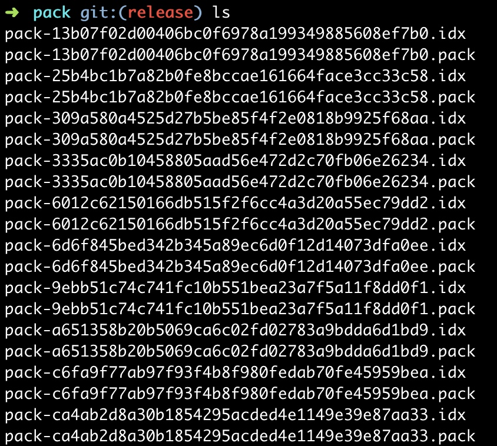

# Git 仓库过大的排查与解决方法

本文主要是对 Git 项目仓库占用空间过大的排查与解决方法的整理，也会对很多不常用的 Git 命令进行介绍，可以给遇到同样问题的同学提供一些思路和方案。

Git 是一个强大的工具，它的内部有一套完备的日志系统记录仓库的每一次操作，放在 `.git` 文件夹中。对于二进制文件，Git 会默认压缩并保存起来，但是对二进制文件的删除操作出于安全性的考虑只会记录删除的操作，二进制文件本身还是会被 Git 保留。这就导致开发者在代码中通过 `git commit` 提交过一次大文件后，大文件会在仓库中永久保留，久而久之就会导致仓库变得很臃肿，影响所有人的 `git pull` 同步时间。

问题的发现是前两天在同步 *vhtml-market* 仓库的时候，花了很长的下载时间。`git count-objects -v` 命令可以查看当前 Git 仓库的解包文件数量和存储空间:


这里解释一下 Git 的包文件 (packfile)，Git 最初向磁盘中存储对象时使用的格式称之为松散格式 (loose)，然后 Git 会定期把存储对象打包为二进制包文件从而可以节省空间。当仓库里存在太多的松散对象，或是向远程仓库推送，或者调用 `git gc` 命令的时候，都会执行这样的打包操作。当提交中存在二进制文件时，二进制文件就会在某个包文件中存储起来。我们可以发现，刚刚执行的统计命令说明包文件的占用空间达到了 161MB（结果显示的单位是KB），这个空间占用肯定是有很大问题的，所以接下来的操作就是进行大文件的排查。

Git 的包文件存储在 `.git/objects/pack` 目录下，该目录储存了以 `.idx` 为后缀的索引文件和以 `.pack` 为后缀的包文件：



我们可以通过 `git verify-pack` 命令对包索引文件进行验证解析。对于 `git verify-pack` 命令，我们可以加一些参数，使得结果按照存储空间占用又小到大进行排列，然后取最大的 10 个二进制文件，具体命令为：

```bash
git verify-pack -v .git/objects/pack/pack-*.idx | sort -k 3 -g | tail -10
```


得到的结果第一列就是文件的 SHA-1 散列值，第三列就是占用空间大小，从上图可以看到，最大的两个文件分别是 92.2M 和 38.7M。

这么大的文件被提交上去在多数情况下都是不正常的，所以我们来查一下这一条记录对应的到底是哪个文件。这里可以使用 `git rev-list` 命令，`git rev-list` 是按照倒序列出所有的 commit，其中有一个 `--objects` 模式，可以列出所有的文件提交记录，通过 `grep <SHA-1>` 进行过滤，就可以找到对应的文件提交记录。这里我们选取了上面获得的最大的几个文件的散列值，具体命令为：（其中 `--all` 是指所有分支)

```bash
git rev-list --objects --all | grep 9039e69fde494651b80c7fc0c9ec5a4d4a5d4c3b
```


我们发现最大的两个文件都是 `node_modules.zip`，后面几个 5M 左右的是图片文件。很明显，`node_modules.zip` 是在提交的时候没注意误把库的压缩包传上去了，这么大的图片文件也不像是正常的提交，当然这个我们需要来查一下哪次提交涉及到这个文件以及这次提交是不是真的是误操作。这里我们一般可以通过 `git log` 命令找到，利用日志的文件匹配功能，我们可以找到与之相关的 commit，完整命令为：

```bash
git log --all -- node_modules.zip
```

根据找到的 commit 结果，我们可以看看当时的提交记录：


确实是把 `node_modules.zip` 误带上去了，虽然在后面的 commit 里删掉了这个文件，不过文件还是被保留在了 Git 的记录里，导致仓库永久性地变大。对于仓库里的几张大图，对应的 commit 评论为测试用图，并在后来进行了删除。之前说过，二进制文件只要上传，就会留在项目仓库里永久增加占用大小，所以大家要注意，用于测试的图片等文件千万不要提交到仓库。

不过正常的 `git log` 命令只能从可达的记录里查找日志，仓库里其实还存在一些不可达的记录，例如之前提到的 92M 的大文件就没有从 `git log` 里找到。我后来在网上查阅了很多方法，找到了一个 perl 脚本可以查到 `blob SHA-1` 对应的 commit 记录：

```perl
#!/usr/bin/perl
use 5.008;
use strict;
use Memoize;

my $obj_name;

sub check_tree {
    my ( $tree ) = @_;
    my @subtree;

    {
        open my $ls_tree, '-|', git => 'ls-tree' => $tree
            or die "Couldn't open pipe to git-ls-tree: $!\n";

        while ( <$ls_tree> ) {
            /\A[0-7]{6} (\S+) (\S+)/
                or die "unexpected git-ls-tree output";
            return 1 if $2 eq $obj_name;
            push @subtree, $2 if $1 eq 'tree';
        }
    }

    check_tree( $_ ) && return 1 for @subtree;

    return;
}

memoize 'check_tree';

die "usage: git-find-blob <blob> [<git-log arguments ...>]\n"
    if not @ARGV;

my $obj_short = shift @ARGV;
$obj_name = do {
    local $ENV{'OBJ_NAME'} = $obj_short;
     `git rev-parse --verify \$OBJ_NAME`;
} or die "Couldn't parse $obj_short: $!\n";
chomp $obj_name;

open my $log, '-|', git => log => @ARGV, '--pretty=format:%T %h %s'
    or die "Couldn't open pipe to git-log: $!\n";

while ( <$log> ) {
    chomp;
    my ( $tree, $commit, $subject ) = split " ", $_, 3;
    print "$commit $subject\n" if check_tree( $tree );
}
```

查找对应 commit 的记录是：


确实是那个最大文件对应的记录，可以发现这也确实是一次误操作导致的结果。

值得一提的是，查到的这些 commit 其实都来源于另一个仓库 *qidian-vea* ，为什么另一个仓库的记录会提交到这个仓库来呢？后来我们进行了一下排查，发现是有同学在设置远程仓库地址 `git remote set-url origin <url>` 的时候不小心填错了仓库地址，从而导致 *qidian-vea* 的分支被 push 到 *vhtml-market* 中，进而把那边仓库的记录都带过来了。由于另一个仓库是业务代码，仓库占用空间比较大可能不太容易发现，而在这个相对较小的仓库里，操作一下子变慢了很多就很明显。

现在通过以上的排查，我们发现所有靠前的大文件都是误提交导致的，因此可以把它们从仓库里清除。接下来我们要做的，就是对仓库的清理工作。之前我们提到，Git 会将所有的大文件以包文件的形式储存起来，涉及到大文件的日志会有一个指向它的指针，我们需要做的，就是把所有涉及到大文件的指针全部删掉，并把大文件删除。

在操作之前，我们需先从远程获取并同步所有分支，从而保证本地是完整的日志信息：

```bash
git branch -r | grep -v '\->' | while read remote; do git branch --track "${remote#origin/}" "$remote"; done
git fetch --all
git pull --all
```

然后就是做上面提到的清理日志的工作了，这里会使用 `git filter-branch` 命令，这个命令主要是用于重写提交历史，所以这操作其实还是比较危险的。完整的清理命令为：

```bash
git filter-branch --force --index-filter 'git rm --cached --ignore-unmatch <filename>' --prune-empty --tag-name-filter cat -- --all
```


这个操作会遍历所有的 commit，并对匹配的记录进行删除修改。在处理完成后，我们就需要对本地仓库重新打包。首先是删除所有的引用，执行命令：

```bash
rm -rf .git/refs/original
```

然后需要对 Git 的参考日志(`reflog`)进行处理。`reflog` 相比 `log` 日志要更加全面，`log` 是根据当前的 HEAD 指针向父级层层遍历，但如果有 `reset` 或者 `rebase` 等操作导致部分 commit 不可达时，`log` 日志就无法显示，但 `reflog` 可以。`reflog` 记录的是 HEAD 的变更历史，所有的操作会记录在里面从而可以便于回滚：


因此我们要做的是，清除 `reflog` 记录，从而彻底解除大文件的引用，这里使用了 `git reflog expire --expire=now --all` 命令，使所有的 `reflog` 过时，当然这里只能按照时间维度删除，所以会把所有记录都删掉。

再之后就是调用 `git gc` 了。`git gc` 命令会清理不必要的文件并优化储存文件，由于我们之前通过一系列的操作导致大文件的引用被销毁，这里 `gc` 的时候自然会清理掉大文件了。完整的命令是：

```bash
git gc --aggressive --prune=now
```

我们再来执行一下 `git count-objects -v`:


很好，只剩 25M 了，大大压缩了仓库的大小。

仓库已经压缩好了，接下来我们就需要把改动强制推送到远端，执行推送命令：

```bash
git push origin --force --all
```

这个操作还是会有很多副作用的：第一，如果仓库有分支处于 protected 被锁状态，需要先解锁再做 push 操作；第二，由于上面一系列操作对仓库的历史记录有变更，其他所有的开发人员都需要重新对远端仓库 `git clone`。

综上所述，这一系列的操作还是具有一定的风险的，操作不当就会把仓库搞坏，而且所有人都得重新拉一下分支，可以说是非常麻烦了。所以说大家以后在提交 Git 记录时一定要注意文件变动，千万不要把不该提交的大文件提交上去了，不然会对仓库造成永久性的影响。
