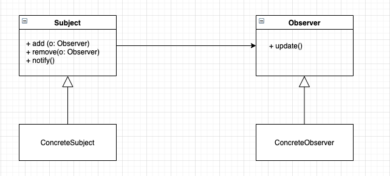

# Vue源码解读笔记

本文是在学习Vue源码时为了加深记忆和理解而整理的一些笔记，目前主要是涉及Vue的核心部分，后面有时间再慢慢补充，也希望能给大家研究Vue原理时带来一些帮助。

> Vue版本号： 2.5.12
> 参考资料： https://ustbhuangyi.github.io/vue-analysis/v2/prepare/

## 响应式原理

Vue相比其它框架最大的特性便是它的响应式系统，将数据和视图进行双向绑定。这一功能的实现设计是一个典型的观察者模式，所谓的观察者模式即存在一个目标 `Subject` 和若干个观察者 `Observer`，观察者会对目标进行订阅，当目标发生变化时，会通知所有的观察者进行更新。观察者模式的UML图如下所示：



Vue的响应式系统也使用了类似的订阅通知机制，下面我们就来详细分析一下这一实现。

### 初始化入口

Vue的初始化阶段会执行 `initState()` 函数，这个函数会对Vue实例中的`props`, `data`, `watch`, `computed`, `methods`等属性进行初始化处理。

```js
// src/core/instance/state.js
export function initState (vm: Component) {
  vm._watchers = []
  const opts = vm.$options
  if (opts.props) initProps(vm, opts.props)
  if (opts.methods) initMethods(vm, opts.methods)
  if (opts.data) {
    initData(vm)
  } else {
    observe(vm._data = {}, true /* asRootData */)
  }
  if (opts.computed) initComputed(vm, opts.computed)
  if (opts.watch && opts.watch !== nativeWatch) {
    initWatch(vm, opts.watch)
  }
}
```

其中 `props` 和 `data` 这两者比较有代表性，因为其它属性会多一些特殊的处理，我们来看一下 `initProps()` 和 `initData()` 这两个函数：

```js
// src/core/instance/state.js
function initProps (vm: Component, propsOptions: Object) {
  const propsData = vm.$options.propsData || {}
  const props = vm._props = {}
  // cache prop keys so that future props updates can iterate using Array
  // instead of dynamic object key enumeration.
  const keys = vm.$options._propKeys = []
  const isRoot = !vm.$parent
  // root instance props should be converted
  if (!isRoot) {
    toggleObserving(false)
  }
  for (const key in propsOptions) {
    keys.push(key)
    const value = validateProp(key, propsOptions, propsData, vm)
    /* istanbul ignore else */
    if (process.env.NODE_ENV !== 'production') {
      const hyphenatedKey = hyphenate(key)
      if (isReservedAttribute(hyphenatedKey) ||
          config.isReservedAttr(hyphenatedKey)) {
        warn(
          `"${hyphenatedKey}" is a reserved attribute and cannot be used as component prop.`,
          vm
        )
      }
      defineReactive(props, key, value, () => {
        if (vm.$parent && !isUpdatingChildComponent) {
          warn(
            `Avoid mutating a prop directly since the value will be ` +
            `overwritten whenever the parent component re-renders. ` +
            `Instead, use a data or computed property based on the prop's ` +
            `value. Prop being mutated: "${key}"`,
            vm
          )
        }
      })
    } else {
      defineReactive(props, key, value)
    }
    // static props are already proxied on the component's prototype
    // during Vue.extend(). We only need to proxy props defined at
    // instantiation here.
    if (!(key in vm)) {
      proxy(vm, `_props`, key)
    }
  }
  toggleObserving(true)
}
```

可以看到，`initProps()` 主要就做两件事：第一是调用 `defineReactive()` 方法对 `props` 里的各个键进行响应式处理；第二是调用 `proxy()` 方法对 `vm._props` 做代理，使得 `vm._props.xxx` 可以通过 `vm.xxx` 直接访问。

```js
// src/core/instance/state.js
function initData (vm: Component) {
  let data = vm.$options.data
  data = vm._data = typeof data === 'function'
    ? getData(data, vm)
    : data || {}
  if (!isPlainObject(data)) {
    data = {}
    process.env.NODE_ENV !== 'production' && warn(
      'data functions should return an object:\n' +
      'https://vuejs.org/v2/guide/components.html#data-Must-Be-a-Function',
      vm
    )
  }
  // proxy data on instance
  const keys = Object.keys(data)
  const props = vm.$options.props
  const methods = vm.$options.methods
  let i = keys.length
  while (i--) {
    const key = keys[i]
    if (process.env.NODE_ENV !== 'production') {
      if (methods && hasOwn(methods, key)) {
        warn(
          `Method "${key}" has already been defined as a data property.`,
          vm
        )
      }
    }
    if (props && hasOwn(props, key)) {
      process.env.NODE_ENV !== 'production' && warn(
        `The data property "${key}" is already declared as a prop. ` +
        `Use prop default value instead.`,
        vm
      )
    } else if (!isReserved(key)) {
      proxy(vm, `_data`, key)
    }
  }
  // observe data
  observe(data, true /* asRootData */)
}
```

`initData()` 跟 `initProps()` 做一样的事，也是两个部分：第一调用 `proxy()` 方法对 `vm._data` 做代理，使得 `vm._data.xxx` 可以通过 `vm.xxx` 直接访问；第二是调用 `observe()` 方法对data本身做响应式处理。

接下来我们对上面使用到的代理和响应式处理函数进行分析。

### 代理与响应式处理

代理其实就是把原本放置于 `vm._data.xxx` 和 `vm._props.xxx` 等的数据可以通过 `vm.xxx` 直接访问，这样会比较方便一些。代理的实现方式如下：

```js
// src/core/instance/state.js
const sharedPropertyDefinition = {
  enumerable: true,
  configurable: true,
  get: noop,
  set: noop
}

export function proxy (target: Object, sourceKey: string, key: string) {
  sharedPropertyDefinition.get = function proxyGetter () {
    return this[sourceKey][key]
  }
  sharedPropertyDefinition.set = function proxySetter (val) {
    this[sourceKey][key] = val
  }
  Object.defineProperty(target, key, sharedPropertyDefinition)
}
```

这里其实就是重新实现了 `getter()` 和 `setter()` 方法 `Object.defineProperty()` 函数重新给对象绑定键，从而实现了代理的效果。

上面提到响应式处理主要使用了 `observe()` 和 `defineReactive()` 函数，我们先来看一下 `observe()` 函数：

```js
// src/core/observer/index.js
export function observe (value: any, asRootData: ?boolean): Observer | void {
  if (!isObject(value) || value instanceof VNode) {
    return
  }
  let ob: Observer | void
  if (hasOwn(value, '__ob__') && value.__ob__ instanceof Observer) {
    ob = value.__ob__
  } else if (
    shouldObserve &&
    !isServerRendering() &&
    (Array.isArray(value) || isPlainObject(value)) &&
    Object.isExtensible(value) &&
    !value._isVue
  ) {
    ob = new Observer(value)
  }
  if (asRootData && ob) {
    ob.vmCount++
  }
  return ob
}
```

`observe()` 方法首先会判断 `value` 是否为对象，如果不是对象或者是 `VNode` 实例则会直接返回。然后会检查对象上是否存在 `__ob__` 变量，如果存在说明已经绑定过则直接返回，如果不存在则进行绑定，这里的 `__ob__` 变量就是一个 `Observer` 类实例。我们来看一下 `Observer` 类的定义：

```js
// src/core/observer/index.js
export class Observer {
  value: any;
  dep: Dep;
  vmCount: number; // number of vms that has this object as root $data

  constructor (value: any) {
    this.value = value
    this.dep = new Dep()
    this.vmCount = 0
    def(value, '__ob__', this)
    if (Array.isArray(value)) {
      const augment = hasProto
        ? protoAugment
        : copyAugment
      augment(value, arrayMethods, arrayKeys)
      this.observeArray(value)
    } else {
      this.walk(value)
    }
  }

  /**
   * Walk through each property and convert them into
   * getter/setters. This method should only be called when
   * value type is Object.
   */
  walk (obj: Object) {
    const keys = Object.keys(obj)
    for (let i = 0; i < keys.length; i++) {
      defineReactive(obj, keys[i])
    }
  }

  /**
   * Observe a list of Array items.
   */
  observeArray (items: Array<any>) {
    for (let i = 0, l = items.length; i < l; i++) {
      observe(items[i])
    }
  }
}
```

可以看到，`Observer` 的构造函数主要做这么几件事：第一，新建一个 `Dep` 类实例，`Dep` 类用于建立依赖收集关系；第二，使用 `def()` 函数给对象绑定一个 `__ob__` 变量；第三根据是否是数组作为判断条件，分别调用 `walk()` 和 `observeArray()` 方法进行响应式处理。

`def()` 函数就是一个对 `Object.defineProperty()` 简单的封装：

```js
// src/core/util/lang.js
export function def (obj: Object, key: string, val: any, enumerable?: boolean) {
  Object.defineProperty(obj, key, {
    value: val,
    enumerable: !!enumerable,
    writable: true,
    configurable: true
  })
}
```

因此实际的Vue数据对象里都会被绑上 `__ob__` 变量。

`walk()` 和 `observeArray()` 函数其实都做类似的事情。只是对于数组而言，调用 `observeArray()` 函数对数列中对每一项进行递归调用 `observe()`；对于对象而言， `walk()` 函数会对对象里的每个键做 `defineReactive()` 绑定，这个其实就跟前文提到的 `initProps()` 里对 `props` 里键的处理一样。所以这里就涉及到一个关键的函数 `defineReactive()`:

```js
// src/core/observer/index.js
/**
 * Define a reactive property on an Object.
 */
export function defineReactive (
  obj: Object,
  key: string,
  val: any,
  customSetter?: ?Function,
  shallow?: boolean
) {
  const dep = new Dep()

  const property = Object.getOwnPropertyDescriptor(obj, key)
  if (property && property.configurable === false) {
    return
  }

  // cater for pre-defined getter/setters
  const getter = property && property.get
  const setter = property && property.set
  if ((!getter || setter) && arguments.length === 2) {
    val = obj[key]
  }

  let childOb = !shallow && observe(val)
  Object.defineProperty(obj, key, {
    enumerable: true,
    configurable: true,
    get: function reactiveGetter () {
      const value = getter ? getter.call(obj) : val
      if (Dep.target) {
        dep.depend()
        if (childOb) {
          childOb.dep.depend()
          if (Array.isArray(value)) {
            dependArray(value)
          }
        }
      }
      return value
    },
    set: function reactiveSetter (newVal) {
      const value = getter ? getter.call(obj) : val
      /* eslint-disable no-self-compare */
      if (newVal === value || (newVal !== newVal && value !== value)) {
        return
      }
      /* eslint-enable no-self-compare */
      if (process.env.NODE_ENV !== 'production' && customSetter) {
        customSetter()
      }
      if (setter) {
        setter.call(obj, newVal)
      } else {
        val = newVal
      }
      childOb = !shallow && observe(newVal)
      dep.notify()
    }
  })
}
```

`defineReactive()` 会对对象里的某个键进行响应式处理。在生成一个 `Dep` 类实例和拿到对象的描述符后，函数的主体部分就是一个 `Object.defineProperty()` 调用，这里的核心逻辑就是重写了 `getter` 和 `setter` 方法，其中 `getter` 是进行依赖收集， `setter` 是进行派发更新，对于其中的子结构会进行递归调用，从而保证了深层对象的响应式效果。

### 观察者模式中的主体：Dep/Watcher

之前我们分别在 `Observer` 类和 `defineReactive()` 函数中提到过，`Dep` 类用于建立依赖收集关系。那我们来看一下 `Dep` 类的实现：

```js
// src/core/observer/dep.js
/**
 * A dep is an observable that can have multiple
 * directives subscribing to it.
 */
export default class Dep {
  static target: ?Watcher;
  id: number;
  subs: Array<Watcher>;

  constructor () {
    this.id = uid++
    this.subs = []
  }

  addSub (sub: Watcher) {
    this.subs.push(sub)
  }

  removeSub (sub: Watcher) {
    remove(this.subs, sub)
  }

  depend () {
    if (Dep.target) {
      Dep.target.addDep(this)
    }
  }

  notify () {
    // stabilize the subscriber list first
    const subs = this.subs.slice()
    for (let i = 0, l = subs.length; i < l; i++) {
      subs[i].update()
    }
  }
}
```

我们可以发现，`Dep` 类就是开头提到的观察者模式中的目标 `Subject` ，主要用于管理 `subs` 也就是 `Watcher` 类实例的订阅和通知。需要注意的是，`Dep` 类中有一个静态属性 `target`，它全局对应唯一一个 `Watcher` 实例，表示同一时间只有一个 `Watcher` 正在被处理。

`Dep` 类中的方法也比较直观：`addSub()` 用于添加 `Watcher` 的订阅，`removeSub()` 用于取消 `Watcher` 的订阅，`depend()` 用于建立到当前目标 `Watcher` 的依赖，`notify()` 用于通知所有订阅 `Watcher` 的更新。

我们大量提到了 `Watcher`, 它对应的就是观察者模式中的观察者 `Observer`，用于发起订阅和接收通知。我们来看一下 `Watcher` 的实现：

```js
// src/core/observer/watcher.js
/**
 * A watcher parses an expression, collects dependencies,
 * and fires callback when the expression value changes.
 * This is used for both the $watch() api and directives.
 */
export default class Watcher {
  vm: Component;
  expression: string;
  cb: Function;
  id: number;
  deep: boolean;
  user: boolean;
  computed: boolean;
  sync: boolean;
  dirty: boolean;
  active: boolean;
  dep: Dep;
  deps: Array<Dep>;
  newDeps: Array<Dep>;
  depIds: SimpleSet;
  newDepIds: SimpleSet;
  before: ?Function;
  getter: Function;
  value: any;

  constructor (
    vm: Component,
    expOrFn: string | Function,
    cb: Function,
    options?: ?Object,
    isRenderWatcher?: boolean
  ) {
    this.vm = vm
    if (isRenderWatcher) {
      vm._watcher = this
    }
    vm._watchers.push(this)
    // options
    if (options) {
      this.deep = !!options.deep
      this.user = !!options.user
      this.computed = !!options.computed
      this.sync = !!options.sync
      this.before = options.before
    } else {
      this.deep = this.user = this.computed = this.sync = false
    }
    this.cb = cb
    this.id = ++uid // uid for batching
    this.active = true
    this.dirty = this.computed // for computed watchers
    this.deps = []
    this.newDeps = []
    this.depIds = new Set()
    this.newDepIds = new Set()
    this.expression = process.env.NODE_ENV !== 'production'
      ? expOrFn.toString()
      : ''
    // parse expression for getter
    if (typeof expOrFn === 'function') {
      this.getter = expOrFn
    } else {
      this.getter = parsePath(expOrFn)
      if (!this.getter) {
        this.getter = function () {}
        process.env.NODE_ENV !== 'production' && warn(
          `Failed watching path: "${expOrFn}" ` +
          'Watcher only accepts simple dot-delimited paths. ' +
          'For full control, use a function instead.',
          vm
        )
      }
    }
    if (this.computed) {
      this.value = undefined
      this.dep = new Dep()
    } else {
      this.value = this.get()
    }
  }

  /**
   * Evaluate the getter, and re-collect dependencies.
   */
  get () {
    pushTarget(this)
    let value
    const vm = this.vm
    try {
      value = this.getter.call(vm, vm)
    } catch (e) {
      if (this.user) {
        handleError(e, vm, `getter for watcher "${this.expression}"`)
      } else {
        throw e
      }
    } finally {
      // "touch" every property so they are all tracked as
      // dependencies for deep watching
      if (this.deep) {
        traverse(value)
      }
      popTarget()
      this.cleanupDeps()
    }
    return value
  }

  /**
   * Add a dependency to this directive.
   */
  addDep (dep: Dep) {
    const id = dep.id
    if (!this.newDepIds.has(id)) {
      this.newDepIds.add(id)
      this.newDeps.push(dep)
      if (!this.depIds.has(id)) {
        dep.addSub(this)
      }
    }
  }

  /**
   * Clean up for dependency collection.
   */
  cleanupDeps () {
    let i = this.deps.length
    while (i--) {
      const dep = this.deps[i]
      if (!this.newDepIds.has(dep.id)) {
        dep.removeSub(this)
      }
    }
    let tmp = this.depIds
    this.depIds = this.newDepIds
    this.newDepIds = tmp
    this.newDepIds.clear()
    tmp = this.deps
    this.deps = this.newDeps
    this.newDeps = tmp
    this.newDeps.length = 0
  }
  // ...
}
```

这里截取了 `Watcher` 的基本结构和几个基础函数，其中 `Watcher` 的构造函数是做一些初始化和赋值的操作，然后触发 `get()` 方法，`get()` 方法主要是调用绑定在 `Watcher` 上的 `getter`。此外还涉及到调用 `Dep` 中的 `pushTarget()` 和 `popTarget()` 函数，这两个函数的实现如下：

```js
// src/core/observer/dep.js

// the current target watcher being evaluated.
// this is globally unique because there could be only one
// watcher being evaluated at any time.
Dep.target = null
const targetStack = []

export function pushTarget (_target: ?Watcher) {
  if (Dep.target) targetStack.push(Dep.target)
  Dep.target = _target
}

export function popTarget () {
  Dep.target = targetStack.pop()
}
```

此处定义了一个 `targetStack` 栈用于存取 `Dep.target`，由于全局的 `Dep.target` 同时只能有一个 `Watcher`，因此当 `pushTarget()` 绑定一个新的 `Watcher` 时便需要临时存储老的 `Watcher`，等到处理完之后再调用 `popTarget()` 还原，在 `Watcher` 实际的 `get()` 方法中就是这样调用的。

`Watcher` 上的 `addDep()` 和 `cleanupDeps()` 方法分别用于收集依赖和销毁依赖，这里我们用一个实际的例子进行过程分析，来剖析依赖收集的整个流程。

### 依赖收集

以Vue的 `mount` 过程为例，这里主要是调用 `mountComponent()` 函数，其中有这么一段代码会涉及依赖收集：

```js
// src/core/instance/lifecycle/js
// ...
updateComponent = () => {
  vm._update(vm._render(), hydrating)
}
new Watcher(vm, updateComponent, noop, {
  before () {
    if (vm._isMounted) {
      callHook(vm, 'beforeUpdate')
    }
  }
}, true /* isRenderWatcher */)
```

这里新建了一个 `Watcher` 实例，调用了它的构造函数，之前提到，构造函数会调用 `Watcher` 的 `get()` 方法：

```js
// src/core/observer/watcher.js
export default class Watcher {
  vm: Component;
  expression: string;
  deep: boolean;
  getter: Function;

  get () {
    pushTarget(this)
    let value
    const vm = this.vm
    try {
      value = this.getter.call(vm, vm)
    } catch (e) {
      if (this.user) {
        handleError(e, vm, `getter for watcher "${this.expression}"`)
      } else {
        throw e
      }
    } finally {
      // "touch" every property so they are all tracked as
      // dependencies for deep watching
      if (this.deep) {
        traverse(value)
      }
      popTarget()
      this.cleanupDeps()
    }
    return value
  }
  // ...
}
```

`get()` 方法首先会执行 `pushTarget()` 方法，把全局的 `Dep.target` 设为当前的 `Watcher` 实例，然后执行 `getter()` 方法，根据前面的赋值，这里的 `getter()` 就是 `updateComponent()` 函数，即调用了 `vm._update()` 方法：

```js
// src/core/instance/lifecycle/js
vm._update(vm._render(), hydrating)
```

这里的 `vm._render()` 函数会执行渲染，生成 `VNode`，这个过程中就会对 `VNode` 上的数据进行访问，触发了 `vm` 上数据对象的 `getter()` 方法，即 `defineReactive()` 函数中的这一些部分：

```js
// src/core/observer/index.js
export function defineReactive (
  obj: Object,
  key: string,
  val: any,
  customSetter?: ?Function,
  shallow?: boolean
) {
  const dep = new Dep()

  const property = Object.getOwnPropertyDescriptor(obj, key)
  if (property && property.configurable === false) {
    return
  }

  const getter = property && property.get
  // ...
  if ((!getter || setter) && arguments.length === 2) {
    val = obj[key]
  }

  let childOb = !shallow && observe(val)
  Object.defineProperty(obj, key, {
    // ...
    get: function reactiveGetter () {
      const value = getter ? getter.call(obj) : val
      if (Dep.target) {
        dep.depend()
        if (childOb) {
          childOb.dep.depend()
          if (Array.isArray(value)) {
            dependArray(value)
          }
        }
      }
      return value
    },
    // ...
  })
}
```

这里首先会调用对象本身的 `getter()` ，由于此时的 `Dep.target` 就是当前的 `Watcher`，所以之后就会进行依赖收集的操作。首先是调用对象持有 `dep` 的 `depend()` 方法，找到当前的 `Watcher`：

```js
// src/core/observer/dep.js
export default class Dep {
  static target: ?Watcher;

  depend () {
    if (Dep.target) {
      Dep.target.addDep(this)
    }
  }
  // ...
}
```

这里会调用当前 `Watcher` 的 `addDep()` 方法：

```js
// src/core/observer/watcher.js
export default class Watcher {
  // ...
  deps: Array<Dep>;
  newDeps: Array<Dep>;
  depIds: SimpleSet;
  newDepIds: SimpleSet;

  constructor (
    vm: Component,
    expOrFn: string | Function,
    cb: Function,
    options?: ?Object,
    isRenderWatcher?: boolean
  ) {
    // ...
    this.deps = []
    this.newDeps = []
    this.depIds = new Set()
    this.newDepIds = new Set()
    // ...
  }

  addDep (dep: Dep) {
    const id = dep.id
    if (!this.newDepIds.has(id)) {
      this.newDepIds.add(id)
      this.newDeps.push(dep)
      if (!this.depIds.has(id)) {
        dep.addSub(this)
      }
    }
  }
  // ...
}
```

这个方法中做了一些逻辑判断，主要是为了保证同一个数据的依赖不会被添加多次，然后就会调用 `dep.addSub()` 方法：

```js
// src/core/observer/dep.js
export default class Dep {
  subs: Array<Watcher>;

  addSub (sub: Watcher) {
    this.subs.push(sub)
  }
  // ...
}
```

也就是把当前 `Watcher` 添加到该数据持有的 `Dep` 依赖中，这样一个数据的依赖关系就建立完毕了，主要是去 `Watcher` 中转了一下，过滤了重复的依赖，最终 `Watcher` 会持有依赖的 `Dep`，`Dep` 也会记录所有用到的 `Watcher`。

继续回到 `defineReactive()` 里的 `getter()`，除了调用对象本身持有的 `Dep` 依赖之外，如果有子层数据，也会对子层调用依赖 `childOb.dep.depend()`；如果对象是一个数组，也会调用 `dependArray()` 执行数组相关的依赖。

建立完依赖关系之后，我们回到 `Watcher` 的 `get()` 方法中的 `finally` 部分，做一些善后工作：

```js
// src/core/observer/watcher.js
export default class Watcher {
  vm: Component;
  expression: string;
  deep: boolean;
  getter: Function;

  get () {
    pushTarget(this)
    let value
    const vm = this.vm
    try {
      value = this.getter.call(vm, vm)
    } catch (e) {
      if (this.user) {
        handleError(e, vm, `getter for watcher "${this.expression}"`)
      } else {
        throw e
      }
    } finally {
      // "touch" every property so they are all tracked as
      // dependencies for deep watching
      if (this.deep) {
        traverse(value)
      }
      popTarget()
      this.cleanupDeps()
    }
    return value
  }
  // ...
}
```

`deep` 状态会对值进行遍历，触发子层所有的 `getter()` 。`popTarget()` 函数之前有提到过，它是使 `targetStack` 出栈，把 `Dep.target` 还原成之前的 `Watcher`，因为当前 `Watcher` 的依赖收集完成。

最后有一个 `cleanupDeps()` 函数的调用，这个函数用于清空依赖：

```js
// src/core/observer/watcher.js
export default class Watcher {
  // ...
  deps: Array<Dep>;
  newDeps: Array<Dep>;
  depIds: SimpleSet;
  newDepIds: SimpleSet;

  cleanupDeps () {
    let i = this.deps.length
    while (i--) {
      const dep = this.deps[i]
      if (!this.newDepIds.has(dep.id)) {
        dep.removeSub(this)
      }
    }
    let tmp = this.depIds
    this.depIds = this.newDepIds
    this.newDepIds = tmp
    this.newDepIds.clear()
    tmp = this.deps
    this.deps = this.newDeps
    this.newDeps = tmp
    this.newDeps.length = 0
  }
  // ...
}
```

这里涉及到了两个 `Dep` 数组，分别对应新的依赖 `newDeps` 和老的依赖 `deps`，`cleanupDeps()` 会把老的依赖通过调用 `removeSub()` 清空依赖关系，然后将刚刚建立的新的依赖关系置为老的依赖：

```js
// src/core/observer/dep.js
export default class Dep {
  subs: Array<Watcher>;

  removeSub (sub: Watcher) {
    remove(this.subs, sub)
  }
  // ...
}
```

清空老的依赖关系的作用主要是为了消除不必要的派发更新。例如一个模板中通过 `v-if` 控制 A 与 B，起初是显示内容 A，所以对 A 的数据建立过依赖收集；当判断条件改变，模板内容切换为 B 后，又对 A 里的数据进行修改，如果 A 的依赖收集关系不清空，则会进行不必要的派发更新。

总结一下，依赖收集的过程主要是通过响应式对象的 `get()` 方法，在 `Dep` 和 `Watcher` 中建立起订阅的依赖关系。

### 派发更新

前面分析了依赖收集的过程，它主要是对应于 `defineReactive()` 中的 `getter()`，那么另外的 `setter()` 部分自然就对应着派发更新的部分，也就是观察者模式中的通知过程。`setter()` 部分的代码如下：

```js
// src/core/observer/index.js
export function defineReactive (
  obj: Object,
  key: string,
  val: any,
  customSetter?: ?Function,
  shallow?: boolean
) {
  const dep = new Dep()

  const property = Object.getOwnPropertyDescriptor(obj, key)
  if (property && property.configurable === false) {
    return
  }

  // cater for pre-defined getter/setters
  const getter = property && property.get
  const setter = property && property.set
  if ((!getter || setter) && arguments.length === 2) {
    val = obj[key]
  }

  let childOb = !shallow && observe(val)
  Object.defineProperty(obj, key, {
    // ...
    set: function reactiveSetter (newVal) {
      const value = getter ? getter.call(obj) : val
      /* eslint-disable no-self-compare */
      if (newVal === value || (newVal !== newVal && value !== value)) {
        return
      }
      // ...
      if (setter) {
        setter.call(obj, newVal)
      } else {
        val = newVal
      }
      childOb = !shallow && observe(newVal)
      dep.notify()
    }
  })
}
```

当用户对某个响应式对象中的数据进行修改时，就会触发这里定义的 `setter()` 方法，在判断与旧值不同后，首先会调用对象本身的 `setter()` 方法，然后就会通知对象持有的 `dep`，即调用 `dep.notify()` 方法：

```js
// src/core/observer/dep.js
export default class Dep {
  subs: Array<Watcher>;

  notify () {
    // stabilize the subscriber list first
    const subs = this.subs.slice()
    for (let i = 0, l = subs.length; i < l; i++) {
      subs[i].update()
    }
  }
  // ...
}
```

这里其实就是遍历所有的 `Watcher`，调用它们的 `update()` 方法：

```js
// src/core/observer/watcher.js
export default class Watcher {
  computed: boolean;
  sync: boolean;
  dirty: boolean;
  dep: Dep;
  /**
   * Subscriber interface.
   * Will be called when a dependency changes.
   */
  update () {
    /* istanbul ignore else */
    if (this.computed) {
      // A computed property watcher has two modes: lazy and activated.
      // It initializes as lazy by default, and only becomes activated when
      // it is depended on by at least one subscriber, which is typically
      // another computed property or a component's render function.
      if (this.dep.subs.length === 0) {
        // In lazy mode, we don't want to perform computations until necessary,
        // so we simply mark the watcher as dirty. The actual computation is
        // performed just-in-time in this.evaluate() when the computed property
        // is accessed.
        this.dirty = true
      } else {
        // In activated mode, we want to proactively perform the computation
        // but only notify our subscribers when the value has indeed changed.
        this.getAndInvoke(() => {
          this.dep.notify()
        })
      }
    } else if (this.sync) {
      this.run()
    } else {
      queueWatcher(this)
    }
  }
  // ...
}
```

对于 `computed` 和 `sync` 这两种状态，`update()` 函数会有一些特殊的逻辑处理。正常的情况下会调用 `queueWatcher()` 函数：

```js
// src/core/observer/scheduler.js
const queue: Array<Watcher> = []
let has: { [key: number]: ?true } = {}
let waiting = false
let flushing = false

/**
 * Push a watcher into the watcher queue.
 * Jobs with duplicate IDs will be skipped unless it's
 * pushed when the queue is being flushed.
 */
export function queueWatcher (watcher: Watcher) {
  const id = watcher.id
  if (has[id] == null) {
    has[id] = true
    if (!flushing) {
      queue.push(watcher)
    } else {
      // if already flushing, splice the watcher based on its id
      // if already past its id, it will be run next immediately.
      let i = queue.length - 1
      while (i > index && queue[i].id > watcher.id) {
        i--
      }
      queue.splice(i + 1, 0, watcher)
    }
    // queue the flush
    if (!waiting) {
      waiting = true
      nextTick(flushSchedulerQueue)
    }
  }
}
```

这个函数主要是处理队列 `queue` 的逻辑，Vue在派发更新时不会每次都直接触发 `Watcher`，而是把 `Watcher` 放到队列里，然后通过 `nextTick()` 函数执行队列里的 `Watcher` 更新。

这里存在这样几个条件的判断。第一是 `flushing`，它表示队列正在执行 `flushSchedulerQueue()`，这种情况下会把 `Watcher` 根据id放到队列对应的位置中，`queue` 是一个排好序的队列。第二是 `waiting`，它表示 `nextTick()` 正在被调用，确保该逻辑只进行一次。

正常情况下，函数会走到 `nextTick()` 调用，这里的 `nextTick()` 和我们实际使用的 `vm.$nextTick()` 是同一个方法，可以认为是在下一个Tick运行 `flushSchedulerQueue()` 函数：

```js
// src/core/observer/scheduler.js
const queue: Array<Watcher> = []
let flushing = false
let index = 0
/**
 * Flush both queues and run the watchers.
 */
function flushSchedulerQueue () {
  flushing = true
  let watcher, id

  // Sort queue before flush.
  // This ensures that:
  // 1. Components are updated from parent to child. (because parent is always
  //    created before the child)
  // 2. A component's user watchers are run before its render watcher (because
  //    user watchers are created before the render watcher)
  // 3. If a component is destroyed during a parent component's watcher run,
  //    its watchers can be skipped.
  queue.sort((a, b) => a.id - b.id)

  // do not cache length because more watchers might be pushed
  // as we run existing watchers
  for (index = 0; index < queue.length; index++) {
    watcher = queue[index]
    if (watcher.before) {
      watcher.before()
    }
    id = watcher.id
    has[id] = null
    watcher.run()
    // in dev build, check and stop circular updates.
    if (process.env.NODE_ENV !== 'production' && has[id] != null) {
      circular[id] = (circular[id] || 0) + 1
      if (circular[id] > MAX_UPDATE_COUNT) {
        warn(
          'You may have an infinite update loop ' + (
            watcher.user
              ? `in watcher with expression "${watcher.expression}"`
              : `in a component render function.`
          ),
          watcher.vm
        )
        break
      }
    }
  }

  // keep copies of post queues before resetting state
  const activatedQueue = activatedChildren.slice()
  const updatedQueue = queue.slice()

  resetSchedulerState()

  // call component updated and activated hooks
  callActivatedHooks(activatedQueue)
  callUpdatedHooks(updatedQueue)

  // devtool hook
  /* istanbul ignore if */
  if (devtools && config.devtools) {
    devtools.emit('flush')
  }
}
```

首先这个函数把 `flushing` 置为 `true`，对应 `queueWatcher()` 函数中的插入队列的逻辑。然后会对队列进行排序，这里就是根据 `watcher.id` 做从小到大的排序，注释中提到有这样三个优点：保证组件从父级更新到子级；用户创建的 `Watcher` 先于 `Render Watcher` 执行；如果子组件在父组件更新的时候销毁，就可以不用执行。

接下来就针对 `Watcher` 队列 `queue` 进行遍历，执行 `watcher.run()`。在遍历过程中，队列的长度不做缓存，因为之前提到，在 `queueWatcher` 中 `flushing` 为 `true` 的时候会直接把 `Watcher` 插入队列导致队列长度发生变化；另外这里还执行了死循环逻辑的判断，同一 `Watcher` 超出一定数量的调用就会跳出循环。

我们来看一下 `Watcher` 中 `run()` 的逻辑：

```js
// src/core/observer/watcher.js
export default class Watcher {
  vm: Component;
  expression: string;
  cb: Function;
  deep: boolean;
  dirty: boolean;
  active: boolean;
  dep: Dep;
  value: any;
  /**
   * Scheduler job interface.
   * Will be called by the scheduler.
   */
  run () {
    if (this.active) {
      this.getAndInvoke(this.cb)
    }
  }

  getAndInvoke (cb: Function) {
    const value = this.get()
    if (
      value !== this.value ||
      // Deep watchers and watchers on Object/Arrays should fire even
      // when the value is the same, because the value may
      // have mutated.
      isObject(value) ||
      this.deep
    ) {
      // set new value
      const oldValue = this.value
      this.value = value
      this.dirty = false
      if (this.user) {
        try {
          cb.call(this.vm, value, oldValue)
        } catch (e) {
          handleError(e, this.vm, `callback for watcher "${this.expression}"`)
        }
      } else {
        cb.call(this.vm, value, oldValue)
      }
    }
  }
  // ...
}
```

`run()` 其实就是执行了 `getAndInvoke()` 方法，这一函数会通过 `get()` 获取到当前的值，然后判断条件，如果满足新值不等于旧值，新值是一个对象，`deep` 模式任一条件的话，则把执行 `cb` 回调，把新值和旧值都作为参数传入，这也是实际开发中的 `vm.watcher` 中我们能够拿到新值和旧值的原因。

之前我们提到，`Render Watcher` 在调用 `get()` 的时候会触发它的 `getter()` 方法，也就是：

```js
// src/core/instance/lifecycle/js
vm._update(vm._render(), hydrating)
```

这就是在我们修改数据时会触发页面重新渲染的原因。在做完一系列更新后，我们回到 `flushSchedulerQueue()` 函数执行后续操作：

```js
// src/core/observer/scheduler.js
const queue: Array<Watcher> = []
let has: { [key: number]: ?true } = {}
let circular: { [key: number]: number } = {}
let waiting = false
let flushing = false
let index = 0
/**
 * Flush both queues and run the watchers.
 */
function flushSchedulerQueue () {
  // ...

  // keep copies of post queues before resetting state
  const activatedQueue = activatedChildren.slice()
  const updatedQueue = queue.slice()

  resetSchedulerState()

  // call component updated and activated hooks
  callActivatedHooks(activatedQueue)
  callUpdatedHooks(updatedQueue)

  // devtool hook
  /* istanbul ignore if */
  if (devtools && config.devtools) {
    devtools.emit('flush')
  }
}

/**
 * Reset the scheduler's state.
 */
function resetSchedulerState () {
  index = queue.length = activatedChildren.length = 0
  has = {}
  if (process.env.NODE_ENV !== 'production') {
    circular = {}
  }
  waiting = flushing = false
}
```

这里首先是调用 `resetSchedulerState()` 函数，主要是把状态和变量恢复，再调用 `activated` 和 `updated` 的钩子函数，这样整个派发更新的流程就结束了。

总结一下，派发更新的过程就是通过响应式对象的 `set()` 方法，根据之前绑定的依赖关系，通知到对应 `Dep` 上的各个 `Watcher`，触发它们的更新，更新的过程以队列的形式组织，做了一定的优化。

### 侦听属性与计算属性

`watch` 和 `computed` 属性的响应过程整体上和之前说的依赖与派发流程比较相近，只是多了一些特殊的处理逻辑。我们先来看一下 `watch` 的初始化：

```js
// src/core/instance/state.js
export function initState (vm: Component) {
  // ...
  if (opts.watch && opts.watch !== nativeWatch) {
    initWatch(vm, opts.watch)
  }
}
function initWatch (vm: Component, watch: Object) {
  for (const key in watch) {
    const handler = watch[key]
    if (Array.isArray(handler)) {
      for (let i = 0; i < handler.length; i++) {
        createWatcher(vm, key, handler[i])
      }
    } else {
      createWatcher(vm, key, handler)
    }
  }
}
```

这里主要就是对 `watch` 里的各个键做遍历，如果 `handler` 不是数组则调用 `createWatcher()` 函数，如果是数组则对里面的每一项分别调用 `createWatcher()` 函数：

```js
// src/core/instance/state.js
function createWatcher (
  vm: Component,
  expOrFn: string | Function,
  handler: any,
  options?: Object
) {
  if (isPlainObject(handler)) {
    options = handler
    handler = handler.handler
  }
  if (typeof handler === 'string') {
    handler = vm[handler]
  }
  return vm.$watch(expOrFn, handler, options)
}
```

这里除了做一些赋值操作外，主要就是调用了 `vm.$watch()` 方法，这个方法在 `stateMixin()` 函数中直接定义在了Vue原型上：

```js
// src/core/instance/state.js
export function stateMixin (Vue: Class<Component>) {
  // ...
  Vue.prototype.$watch = function (
    expOrFn: string | Function,
    cb: any,
    options?: Object
  ): Function {
    const vm: Component = this
    if (isPlainObject(cb)) {
      return createWatcher(vm, expOrFn, cb, options)
    }
    options = options || {}
    options.user = true
    const watcher = new Watcher(vm, expOrFn, cb, options)
    if (options.immediate) {
      cb.call(vm, watcher.value)
    }
    return function unwatchFn () {
      watcher.teardown()
    }
  }
}
```

这里一般情况下，`cb` 就是 `watch` 属性里的回调函数，所以会新建一个 `Watcher` 的实例，它的回调函数就是我们写在 `watch` 里的回调函数。

当 `watch` 侦听的数据发生改变时，会触发它的 `setter()` 方法，也就会触发数据的派发更新的过程。之前有提到，在 `Watcher` 的 `getAndInvoke()` 方法中会执行 `cb.call(this.vm, value, oldValue)`：

```js
// src/core/observer/watcher.js
export default class Watcher {
  vm: Component;
  expression: string;
  cb: Function;
  deep: boolean;
  dirty: boolean;
  active: boolean;
  dep: Dep;
  value: any;
  /**
   * Scheduler job interface.
   * Will be called by the scheduler.
   */
  run () {
    if (this.active) {
      this.getAndInvoke(this.cb)
    }
  }

  getAndInvoke (cb: Function) {
    const value = this.get()
    if (
      value !== this.value ||
      // Deep watchers and watchers on Object/Arrays should fire even
      // when the value is the same, because the value may
      // have mutated.
      isObject(value) ||
      this.deep
    ) {
      // set new value
      const oldValue = this.value
      this.value = value
      this.dirty = false
      if (this.user) {
        try {
          cb.call(this.vm, value, oldValue)
        } catch (e) {
          handleError(e, this.vm, `callback for watcher "${this.expression}"`)
        }
      } else {
        cb.call(this.vm, value, oldValue)
      }
    }
  }
  // ...
}
```

我们可以发现，这里的 `cb` 就是 `watch` 属性中的回调函数，同时会传入新值和旧值，这就解释了 `watch` 属性的运行机制。

值得一提的是 `watch` 的 `deep` 参数，它可以监听深层对象数据的变化并做出响应。在 `Watcher` 里主要涉及的是 `get()` 函数里的逻辑：

```js
// src/core/observer/watcher.js
export default class Watcher {
  vm: Component;
  expression: string;
  deep: boolean;
  getter: Function;

  get () {
    pushTarget(this)
    let value
    const vm = this.vm
    try {
      value = this.getter.call(vm, vm)
    } catch (e) {
      if (this.user) {
        handleError(e, vm, `getter for watcher "${this.expression}"`)
      } else {
        throw e
      }
    } finally {
      // "touch" every property so they are all tracked as
      // dependencies for deep watching
      if (this.deep) {
        traverse(value)
      }
      popTarget()
      this.cleanupDeps()
    }
    return value
  }
  // ...
}
```

这里在触发完 `Watcher` 本身的 `getter()` 之后，还会调用 `traverse()` 函数：

```js
// src/core/observer/traverse.js
const seenObjects = new Set()

/**
 * Recursively traverse an object to evoke all converted
 * getters, so that every nested property inside the object
 * is collected as a "deep" dependency.
 */
export function traverse (val: any) {
  _traverse(val, seenObjects)
  seenObjects.clear()
}

function _traverse (val: any, seen: SimpleSet) {
  let i, keys
  const isA = Array.isArray(val)
  if ((!isA && !isObject(val)) || Object.isFrozen(val) || val instanceof VNode) {
    return
  }
  if (val.__ob__) {
    const depId = val.__ob__.dep.id
    if (seen.has(depId)) {
      return
    }
    seen.add(depId)
  }
  if (isA) {
    i = val.length
    while (i--) _traverse(val[i], seen)
  } else {
    keys = Object.keys(val)
    i = keys.length
    while (i--) _traverse(val[keys[i]], seen)
  }
}
```

这个函数主要的逻辑就是对对象或者数组做遍历，从而触发子层数据的 `get()` 方法，收集到子层数据的依赖。这样当子层数据发生变化时，也可以发起派发更新的过程。当然这个过程会遍历整个对象数据，造成一定的性能开销。

以上就是侦听属性的流程，对于计算属性而言，在流程的细节上会有一些差异，我们先从 `computed` 的初始化开始：

```js
// src/core/instance/state.js
export function initState (vm: Component) {
  // ...
  if (opts.computed) initComputed(vm, opts.computed)
}
function initComputed (vm: Component, computed: Object) {
  // $flow-disable-line
  const watchers = vm._computedWatchers = Object.create(null)
  // computed properties are just getters during SSR
  const isSSR = isServerRendering()

  for (const key in computed) {
    const userDef = computed[key]
    const getter = typeof userDef === 'function' ? userDef : userDef.get
    if (process.env.NODE_ENV !== 'production' && getter == null) {
      warn(
        `Getter is missing for computed property "${key}".`,
        vm
      )
    }

    if (!isSSR) {
      // create internal watcher for the computed property.
      watchers[key] = new Watcher(
        vm,
        getter || noop,
        noop,
        computedWatcherOptions
      )
    }

    // component-defined computed properties are already defined on the
    // component prototype. We only need to define computed properties defined
    // at instantiation here.
    if (!(key in vm)) {
      defineComputed(vm, key, userDef)
    } else if (process.env.NODE_ENV !== 'production') {
      if (key in vm.$data) {
        warn(`The computed property "${key}" is already defined in data.`, vm)
      } else if (vm.$options.props && key in vm.$options.props) {
        warn(`The computed property "${key}" is already defined as a prop.`, vm)
      }
    }
  }
}
```

这里的初始化首先会对每个键创建一个 `Watcher` (非服务器渲染模式)，这里的 `Watcher` 会传入 `computed` 参数表示计算模式，我们称之为 `Computed Watcher`；后面主要是给 `computed` 里的每个键执行 `defineComputed()` 函数：

```js
// src/core/instance/state.js
export function defineComputed (
  target: any,
  key: string,
  userDef: Object | Function
) {
  const shouldCache = !isServerRendering()
  if (typeof userDef === 'function') {
    sharedPropertyDefinition.get = shouldCache
      ? createComputedGetter(key)
      : userDef
    sharedPropertyDefinition.set = noop
  } else {
    sharedPropertyDefinition.get = userDef.get
      ? shouldCache && userDef.cache !== false
        ? createComputedGetter(key)
        : userDef.get
      : noop
    sharedPropertyDefinition.set = userDef.set
      ? userDef.set
      : noop
  }
  if (process.env.NODE_ENV !== 'production' &&
      sharedPropertyDefinition.set === noop) {
    sharedPropertyDefinition.set = function () {
      warn(
        `Computed property "${key}" was assigned to but it has no setter.`,
        this
      )
    }
  }
  Object.defineProperty(target, key, sharedPropertyDefinition)
}
```

`defineComputed()` 函数其实就是一个响应式对象的绑定，这里主要是调用了 `createComputedGetter()` 方法：

```js
// src/core/instance/state.js
function createComputedGetter (key) {
  return function computedGetter () {
    const watcher = this._computedWatchers && this._computedWatchers[key]
    if (watcher) {
      watcher.depend()
      return watcher.evaluate()
    }
  }
}
```

这里会返回一个 `getter()` 函数。其中 `this._computedWatchers[key]` 其实就是初始化阶段创建的每个键对应的 `Watcher`，然后做了 `watch.depend()` 操作建立起依赖关系，并返回 `watcher.evaluate()` 的结果：

```js
// src/core/observer/watcher.js
export default class Watcher {
  dirty: boolean;
  value: any;

  /**
   * Evaluate and return the value of the watcher.
   * This only gets called for computed property watchers.
   */
  evaluate () {
    if (this.dirty) {
      this.value = this.get()
      this.dirty = false
    }
    return this.value
  }
  // ...
}
```

这里主要就是返回当前值，当然有一个 `dirty` 参数表示脏数据，需要重新触发 `get()` 方法，由于构造函数里的 `this.dirty = this.computed` 这句话，第一次调用是需要执行 `get()` 方法的。我们来结合一个实际使用的计算属性例子进行过程分析：

```js
new Vue({
  data: {
    x: 1,
    y: 2
  },
  computed: {
    total: () => this.x + this.y
  }
})
```

之前我们提到，`computed` 属性会生成对应的 `Watcher`，且为计算模式 `Computed Watcher`：

```js
// src/core/observer/watcher.js
export default class Watcher {
  computed: boolean;
  dep: Dep;
  value: any;

  constructor (
    vm: Component,
    expOrFn: string | Function,
    cb: Function,
    options?: ?Object,
    isRenderWatcher?: boolean
  ) {
    // ...
    if (options) {
      this.computed = !!options.computed
      // ...
    } else {
      this.deep = this.user = this.computed = this.sync = false
    }
    // ...
    if (this.computed) {
      this.value = undefined
      this.dep = new Dep()
    } else {
      this.value = this.get()
    }
  }
}
```

一般的模式会在构造函数中直接调用 `get()` 方法求值从而触发依赖，而计算属性则不会直接触发，而是生成并持有一个 `Dep` 实例。只有当模板渲染函数访问了 `total` 之后，才会触发 `total` 的 `getter()`。之前我们提到，计算属性的 `getter()` 被写成这样的形式：

```js
// src/core/instance/state.js
function createComputedGetter (key) {
  return function computedGetter () {
    const watcher = this._computedWatchers && this._computedWatchers[key]
    if (watcher) {
      watcher.depend()
      return watcher.evaluate()
    }
  }
}
```

这里就会触发 `Computed Watcher` 本身的 `depend()`：

```js
// src/core/observer/dep.js
export default class Dep {
  static target: ?Watcher;

  depend () {
    if (Dep.target) {
      Dep.target.addDep(this)
    }
  }
  // ...
}
```

由于我们是在渲染过程中，这个时候的 `Dep.target` 就是 `Render Watcher`，因此 `Render Watcher` 订阅了 `Computed Watcher` 的变化。最后调用 `evaluate()` 方法，我们之前分析过就是一个返回值的操作，由于是第一次渲染，会调用 `get()` 方法：

```js
// src/core/observer/watcher.js
export default class Watcher {
  vm: Component;
  deep: boolean;
  getter: Function;

  get () {
    pushTarget(this)
    let value
    const vm = this.vm
    try {
      value = this.getter.call(vm, vm)
    } catch (e) {
      // ...
    } finally {
      // "touch" every property so they are all tracked as
      // dependencies for deep watching
      if (this.deep) {
        traverse(value)
      }
      popTarget()
      this.cleanupDeps()
    }
    return value
  }
  // ...
}
```

这里的 `getter()` 其实就是我们在 `vm` 实例中定义的回调函数：

```js
() => this.x + this.y
```

这样我们就会触发 `x` 和 `y` 这两个变量的 `getter()`，触发它们的依赖收集过程，这一过程的 `Dep.target` 指向的是 `Computed Watcher`。

当 `x` 发生改变时，会触发它的 `setter()`，我们之前提到这会触发派发更新的过程。刚才提到，`x` 的依赖被 `Computed Watcher` 订阅，因此在 `notify()` 的通知过程中，会调用 `Computed Watcher` 的 `update()` 方法：

```js
// src/core/observer/watcher.js
export default class Watcher {
  computed: boolean;
  sync: boolean;
  dirty: boolean;
  dep: Dep;
  /**
   * Subscriber interface.
   * Will be called when a dependency changes.
   */
  update () {
    /* istanbul ignore else */
    if (this.computed) {
      // A computed property watcher has two modes: lazy and activated.
      // It initializes as lazy by default, and only becomes activated when
      // it is depended on by at least one subscriber, which is typically
      // another computed property or a component's render function.
      if (this.dep.subs.length === 0) {
        // In lazy mode, we don't want to perform computations until necessary,
        // so we simply mark the watcher as dirty. The actual computation is
        // performed just-in-time in this.evaluate() when the computed property
        // is accessed.
        this.dirty = true
      } else {
        // In activated mode, we want to proactively perform the computation
        // but only notify our subscribers when the value has indeed changed.
        this.getAndInvoke(() => {
          this.dep.notify()
        })
      }
    } else if (this.sync) {
      this.run()
    } else {
      queueWatcher(this)
    }
  }
  // ...
}
```

这里在注释中提到，`Computed Watcher` 有两种模式：lazy 与 activated。lazy 状态指的是当 `this.dep.subs.length = 0`，即 `Computed Watcher` 没有被订阅的时候，会直接把 `dirty` 置为 `true`，而不会去重新计算新值，之前有提过在 `evaluate()` 中，当该属性被再次访问时，才会重新计算记过。当有被订阅的时候就是 activated 状态，它会调用 `getAndInvoke()` 方法：

```js
// src/core/observer/watcher.js
export default class Watcher {
  vm: Component;
  expression: string;
  deep: boolean;
  dirty: boolean;
  active: boolean;
  dep: Dep;
  value: any;

  getAndInvoke (cb: Function) {
    const value = this.get()
    if (
      value !== this.value ||
      // Deep watchers and watchers on Object/Arrays should fire even
      // when the value is the same, because the value may
      // have mutated.
      isObject(value) ||
      this.deep
    ) {
      // set new value
      const oldValue = this.value
      this.value = value
      this.dirty = false
      if (this.user) {
        try {
          cb.call(this.vm, value, oldValue)
        } catch (e) {
          handleError(e, this.vm, `callback for watcher "${this.expression}"`)
        }
      } else {
        cb.call(this.vm, value, oldValue)
      }
    }
  }
  // ...
}
```

这里会重新调用 `get()` 方法计算新值，如果发现差异，则调用 `dep.notify()` 派发更新通知。这里的 `this.dep` 即指向持有 `Render Watcher` 的 `Dep`，从而导致页面的重新渲染。

### 对象与数组的操作

之前我们提到，响应式原理的实现需要把数据全部转化为响应式结构，这里主要是靠 `defineReactive()` 方法覆盖 `getter()` 和 `setter()` 方法。对于对象和数组，存在一些可以绕过 `setter()` 的情况，这样就会使得响应式失效。针对这些场景，Vue实现了一些方式解决这样的问题，我们来看一下这些情况。

对于对象而言，如果给一个对象添加一个新的属性，直接通过 `obj.x = 0` 这样的赋值操作，是不会触发 `obj` 的 `setter()` 的，这样是没有办法触发 `obj` 的变化响应的。解决方法就是使用 `vm.$set()` 来添加属性，这一函数的定义如下：

```js
// src/core/observer/index.js
/**
 * Set a property on an object. Adds the new property and
 * triggers change notification if the property doesn't
 * already exist.
 */
export function set (target: Array<any> | Object, key: any, val: any): any {
  if (process.env.NODE_ENV !== 'production' &&
    (isUndef(target) || isPrimitive(target))
  ) {
    warn(`Cannot set reactive property on undefined, null, or primitive value: ${target}`)
  }
  if (Array.isArray(target) && isValidArrayIndex(key)) {
    target.length = Math.max(target.length, key)
    target.splice(key, 1, val)
    return val
  }
  if (key in target && !(key in Object.prototype)) {
    target[key] = val
    return val
  }
  const ob = target.__ob__
  if (target._isVue || (ob && ob.vmCount)) {
    process.env.NODE_ENV !== 'production' && warn(
      'Avoid adding reactive properties to a Vue instance or its root $data ' +
      'at runtime - declare it upfront in the data option.'
    )
    return val
  }
  if (!ob) {
    target[key] = val
    return val
  }
  defineReactive(ob.value, key, val)
  ob.dep.notify()
  return val
}
```

这一函数首先针对数组做了不同的处理，直接走数组的逻辑；对对象而言，则调用 `defineReactive()` 方法，将新属性也变为响应式。最后由于对象发生改变，手动调用 `dep.notify()` 派发更新，从而使得新增属性的操作可以触发变化的响应，解决了无法响应变化的问题。

对于数组来说，当用索引下标直接新建一个项 `ar[1] = 1`，或者直接改变数组的长度 `ar.length = 0`，都是无法触发数组的响应变化的，原因跟对象一样，都是绕过了数组的 `setter()` 方法。这里的解决方法除了使用 `vm.$set()` 外，Vue也重写了数组的一系列函数，可以直接调用数组的 `splice()` 等函数解决。这里主要是因为数组在转化为响应式对象时，会先进行这样的处理：

```js
// src/core/observer/index.js
export class Observer {
  value: any;

  constructor (value: any) {
    ///
    def(value, '__ob__', this)
    if (Array.isArray(value)) {
      const augment = hasProto
        ? protoAugment
        : copyAugment
      augment(value, arrayMethods, arrayKeys)
      this.observeArray(value)
    } else {
      this.walk(value)
    }
  }
}
```

这里其实就是根据对象中是否存在 `__proto__`，分别做不一样的逻辑：

```js
// src/core/observer/index.js
/**
 * Augment an target Object or Array by intercepting
 * the prototype chain using __proto__
 */
function protoAugment (target, src: Object, keys: any) {
  /* eslint-disable no-proto */
  target.__proto__ = src
  /* eslint-enable no-proto */
}

/**
 * Augment an target Object or Array by defining
 * hidden properties.
 */
/* istanbul ignore next */
function copyAugment (target: Object, src: Object, keys: Array<string>) {
  for (let i = 0, l = keys.length; i < l; i++) {
    const key = keys[i]
    def(target, key, src[key])
  }
}
```

大部分情况下，数组都是有 `__proto__` 的，这里就只是简单的把 `__proto__` 修改为 `arrayMethods`:

```js
// src/core/observer/array.js
const arrayProto = Array.prototype
export const arrayMethods = Object.create(arrayProto)

const methodsToPatch = [
  'push',
  'pop',
  'shift',
  'unshift',
  'splice',
  'sort',
  'reverse'
]

/**
 * Intercept mutating methods and emit events
 */
methodsToPatch.forEach(function (method) {
  // cache original method
  const original = arrayProto[method]
  def(arrayMethods, method, function mutator (...args) {
    const result = original.apply(this, args)
    const ob = this.__ob__
    let inserted
    switch (method) {
      case 'push':
      case 'unshift':
        inserted = args
        break
      case 'splice':
        inserted = args.slice(2)
        break
    }
    if (inserted) ob.observeArray(inserted)
    // notify change
    ob.dep.notify()
    return result
  })
})
```

可以看到，这里就是针对数组的一些方法进行了改写，把新添加的值进行了响应式的处理，然后手动调用 `dep.notify()` 触发通知，从而能够实现数组的派发更新。

总而言之，针对对象和数组的一些修改，Vue 重写并提供了一些方法来保证响应式的触发。

## nextTick

我们在实际开发中，对于异步执行的场景常常会调用 `vm.$nextTick()` 函数，包括在之前的响应式派发更新中，也提到 `queueWatcher` 会调用 `nextTick(flushSchedulerQueue)` 对队列进行处理。这里的两个 `nextTick()` 函数其实指向的是同一个函数：

```js
// src/core/util/next-tick.js
const callbacks = []
let pending = false

export function nextTick (cb?: Function, ctx?: Object) {
  let _resolve
  callbacks.push(() => {
    if (cb) {
      try {
        cb.call(ctx)
      } catch (e) {
        handleError(e, ctx, 'nextTick')
      }
    } else if (_resolve) {
      _resolve(ctx)
    }
  })
  if (!pending) {
    pending = true
    if (useMacroTask) {
      macroTimerFunc()
    } else {
      microTimerFunc()
    }
  }
  // $flow-disable-line
  if (!cb && typeof Promise !== 'undefined') {
    return new Promise(resolve => {
      _resolve = resolve
    })
  }
}
```

这里主要就是把回调函数放进队列，然后通过 `macroTimerFunc()` 或者 `microTimerFunc()` 来执行。在分析这两个函数之前，我们需要对 Javascript 的线程运行机制进行一些了解。

### MacroTask 和 MicroTask

Javascript 的执行是单线程的，它有这样几个步骤：

- 所有的同步任务都在主线程上运行，形成一个执行栈 (execution context stack)；

- 异步任务是在工作线程上运行，运行得到结果后会往任务队列 (task queue) 中放置一个事件；

- 当执行栈清空所有的任务后，就会按照先入先出的顺序去读取任务队列，任务队列里的事件所对应的异步任务就会结束等待，转到执行栈运行；

举个实际的例子就是：

```js
// 1. 开始执行
console.log('start');        // 2. 打印 "start"
setTimeout(() => {           // 3. 调用 setTimeout 函数，并定义其完成后执行的回调函数，浏览器在 0ms 之后将该函数推入任务队列
  console.log('timeout');    // 6. 打印 "timeout"
}, 0);
console.log('end');          // 4. 打印 "end"
// 5. 主线程执行栈清空，开始读取任务队列中的任务
```

对于异步任务而言，还有 MacroTask 和 MicroTask 的区分，它的定义区别如下：

**MacroTask**: setTimeout, setInterval, setImmediate, I/O, UI rendering

**MicroTask**: process.nextTick, Promise, MutationObserver

MacroTask 和 MicroTask 的区别可以通过这样的一段代码来看一下它们的执行逻辑：

```js
for (macroTask of macroTaskQueue) {
  handleMacroTask();

  for (microTask of microTaskQueue) {
    handleMicroTask(microTask);
  }
}
```

也就是说 MacroTask 一次只会取一个执行，而 MicroTask 会在执行完一个 MacroTask 后清空。

举个实际的例子就是：

```js
// 1. 开始执行
console.log('start');           // 2. 打印 "start"
setTimeout(() => {              // 9. MicroTaskQueue 清空，处理 MacroTaskQueue 中的 setTimeout 回调函数
  console.log('timeout');       // 10. 打印 "timeout"
}, 0);                          // 3. 调用 setTimeout 函数，并定义其完成后执行的回调函数，浏览器在 0ms 之后将该函数推入任务队列 MacroTaskQueue
Promise.resolve().then(() => {
  console.log('promise1');      // 7. 按照先进先出原则，先打印 "promise1"
}).then(() => {
  console.log('promise2');      // 8. 打印 "promise2"
});                             // 4. 调用 Promise.resolve 函数，并定义其完成后执行的两个回调函数，浏览器在 0ms 之后将两个函数推入任务队列 MicroTaskQueue
console.log('end');             // 5. 打印 "end"
// 6. 主线程执行栈清空，开始读取任务队列中的任务，这个时候 MacroTaskQueue 和 MicroTaskQueue 中都有任务，因为主流程是一个 MacroTask 任务，所以先处理 MicroTaskQueue
```

### Vue 的 nextTick 实现

我们对 MacroTask 和 MicroTask 有了一些了解后，再回过来看一下之前提到的 `macroTimerFunc()` 和 `microTimerFunc()`：

```js
// src/core/util/next-tick.js
const callbacks = []
let pending = false

function flushCallbacks () {
  pending = false
  const copies = callbacks.slice(0)
  callbacks.length = 0
  for (let i = 0; i < copies.length; i++) {
    copies[i]()
  }
}

// Here we have async deferring wrappers using both microtasks and (macro) tasks.
// In < 2.4 we used microtasks everywhere, but there are some scenarios where
// microtasks have too high a priority and fire in between supposedly
// sequential events (e.g. #4521, #6690) or even between bubbling of the same
// event (#6566). However, using (macro) tasks everywhere also has subtle problems
// when state is changed right before repaint (e.g. #6813, out-in transitions).
// Here we use microtask by default, but expose a way to force (macro) task when
// needed (e.g. in event handlers attached by v-on).
let microTimerFunc
let macroTimerFunc
let useMacroTask = false

// Determine (macro) task defer implementation.
// Technically setImmediate should be the ideal choice, but it's only available
// in IE. The only polyfill that consistently queues the callback after all DOM
// events triggered in the same loop is by using MessageChannel.
/* istanbul ignore if */
if (typeof setImmediate !== 'undefined' && isNative(setImmediate)) {
  macroTimerFunc = () => {
    setImmediate(flushCallbacks)
  }
} else if (typeof MessageChannel !== 'undefined' && (
  isNative(MessageChannel) ||
  // PhantomJS
  MessageChannel.toString() === '[object MessageChannelConstructor]'
)) {
  const channel = new MessageChannel()
  const port = channel.port2
  channel.port1.onmessage = flushCallbacks
  macroTimerFunc = () => {
    port.postMessage(1)
  }
} else {
  /* istanbul ignore next */
  macroTimerFunc = () => {
    setTimeout(flushCallbacks, 0)
  }
}

// Determine microtask defer implementation.
/* istanbul ignore next, $flow-disable-line */
if (typeof Promise !== 'undefined' && isNative(Promise)) {
  const p = Promise.resolve()
  microTimerFunc = () => {
    p.then(flushCallbacks)
    // in problematic UIWebViews, Promise.then doesn't completely break, but
    // it can get stuck in a weird state where callbacks are pushed into the
    // microtask queue but the queue isn't being flushed, until the browser
    // needs to do some other work, e.g. handle a timer. Therefore we can
    // "force" the microtask queue to be flushed by adding an empty timer.
    if (isIOS) setTimeout(noop)
  }
} else {
  // fallback to macro
  microTimerFunc = macroTimerFunc
}
```

可以看到，`macroTimerFunc()` 和 `microTimerFunc()` 分别对应 MacroTask 和 MicroTask 的函数实现，只是在不同的环境下使用了不同的实现方法，然后调用 `flushCallbacks()` 把 `callbacks` 数组中的回调进行处理。再回到 `nextTick()` 方法：

```js
// src/core/util/next-tick.js
const callbacks = []
let pending = false

export function nextTick (cb?: Function, ctx?: Object) {
  let _resolve
  callbacks.push(() => {
    if (cb) {
      try {
        cb.call(ctx)
      } catch (e) {
        handleError(e, ctx, 'nextTick')
      }
    } else if (_resolve) {
      _resolve(ctx)
    }
  })
  if (!pending) {
    pending = true
    if (useMacroTask) {
      macroTimerFunc()
    } else {
      microTimerFunc()
    }
  }
  // ...
}
```

这样看 `nextTick()` 函数其实就是把回调函数放到 `callbacks` 队列中，运用 MacroTask 或 MicroTask 异步执行。这里用了一个 `callbacks` 数组是为了在同一个 Tick 中执行多个 nextTick，而不是开启多个任务。

之前我们有提到，派发更新中的重新渲染会在 `nextTick()` 中异步调用，所以当我们实际需要在 DOM 更新变化后再执行一些逻辑的话，就要用 `vm.$nextTick()` 函数执行。

（其它部分有时间慢慢补充）
